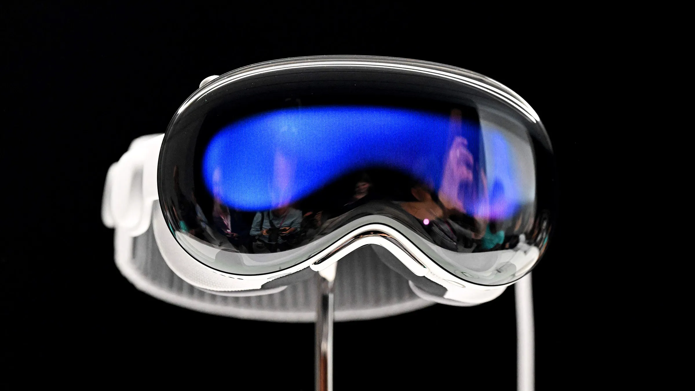
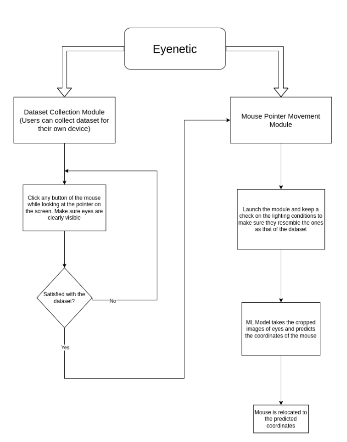

# Eyenetic: Cursor control using eye tracking
Hello there, So this is one of my many prototype stage projects. It's not entirely original but the way that I have tried to implement is. To Give an overview of what the project is, you can basically **control the cursor on your device with your eyes.**

## But Naman, why would I want to do so?
Cursor movement using eyes while may not seem so appealing as a stand alone thing, but when you talk about trying to extend it's applications, there are lots and lots of them. One of the applicatios for which I intended to do so was for the physically disabled people.
## How Eyentic may find its application in real life
`Spoiler alert: It kind of has done it already`  
Well not exactly as **Eyenetic**, but a similar way of using eye-tracking for cursor control and extending it's applications is done by none other than **Apple** themselves. [Here's](https://www.youtube.com/watch?v=TX9qSaGXFyg) a demo video they uploaded this year (2023) showing the power of eyetracking when combined with AR and VR.

## So that's what we're gonna see??
No.  
My intention of making eyentic was based off of a different perspective. It was to map the controls of the wheelchair of a physically disabled person to the screen and then help them locomote using their eyes.

## Workflow of Eyenetic
Given below is a somewhat simplified flow of how the files in this repository work together. The details of how to run the code on your device are given [here](./Codefiles/readme.md)

## Future Plans
As this was just a prototype, the images of the eyes used were of very low resolution `(32x32)` and the dataset was ***manually collected*** which accounted for only ***1000 images***  
The future updates of eyenetic would focus on the following:*` (as of June 2022) `*  
* Using a better device for dataset collection (something like a phone camera).
* Increasing the post cropping resolution of the captured images and collecting a larger dataset.
* Updating the model architecture to handle the higher resolution images.
* Creating a basic front end to make it presentable and visually appealing